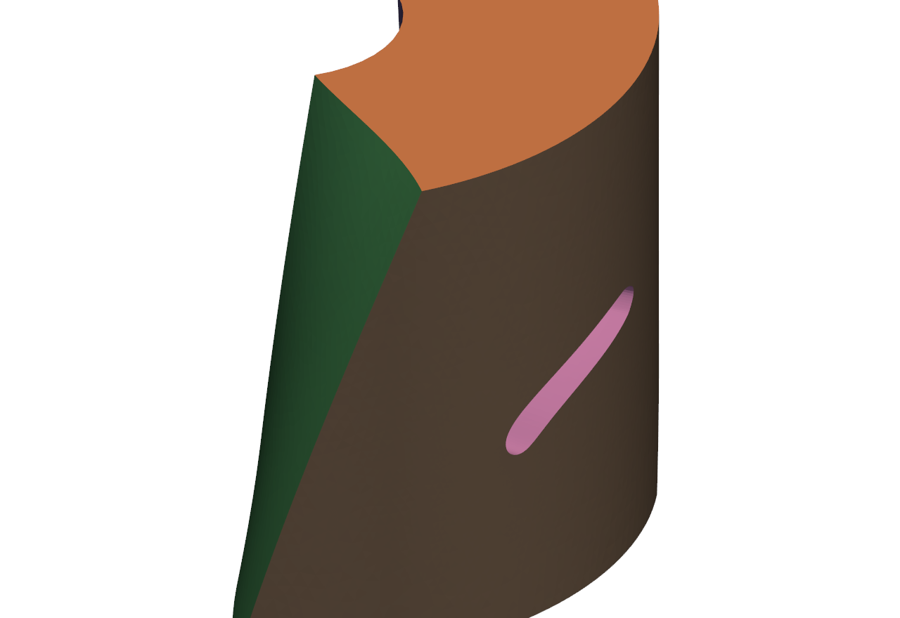
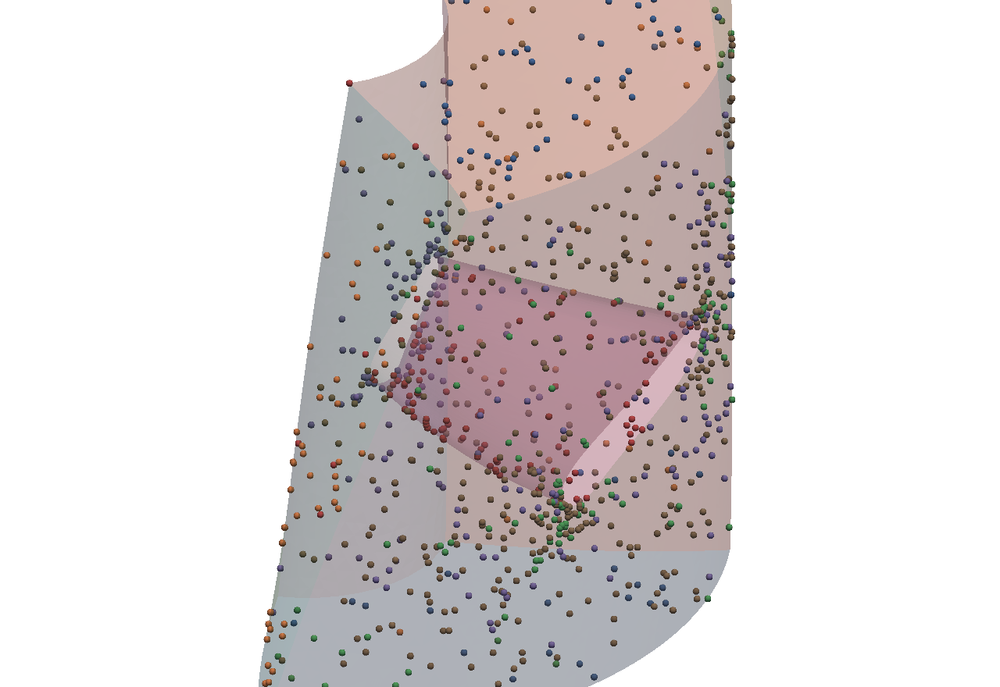
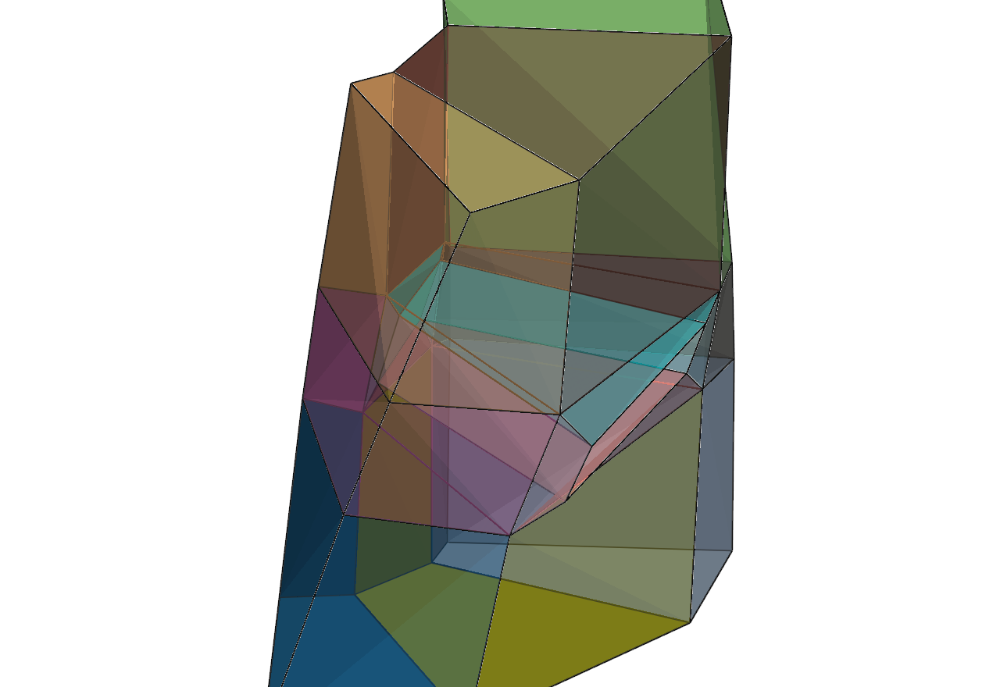
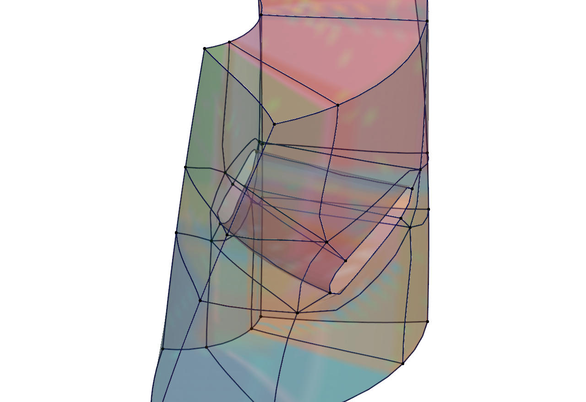
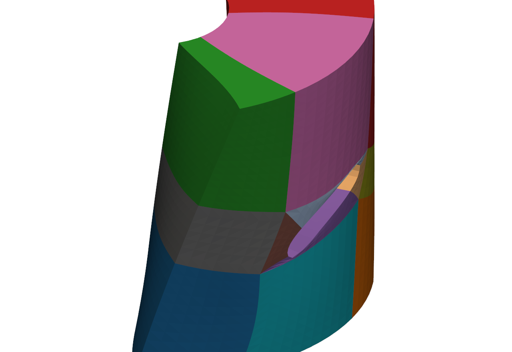
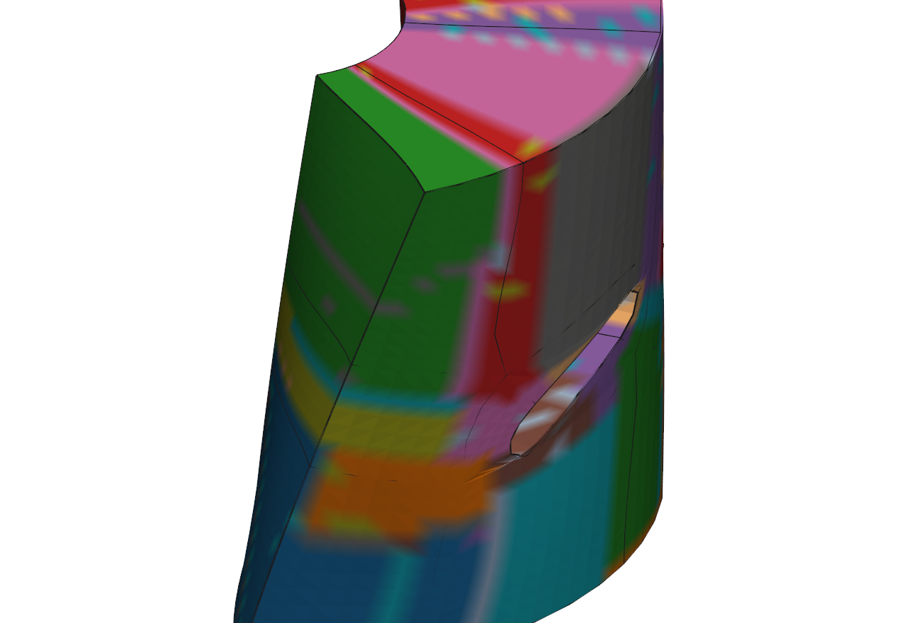
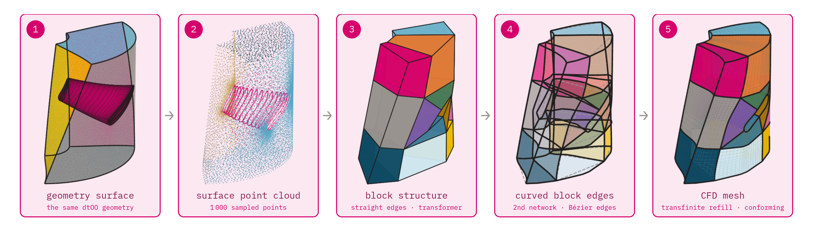
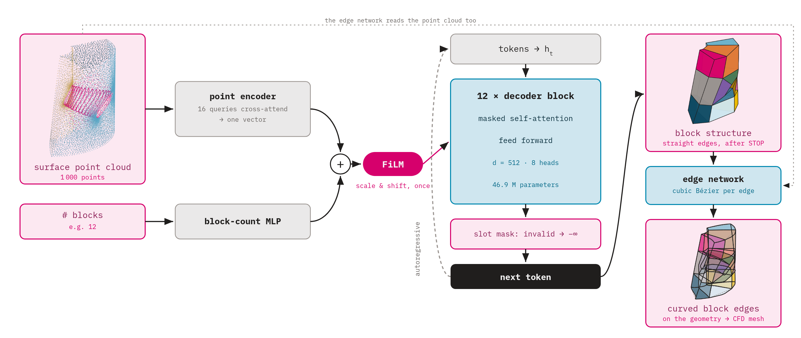

# meshtron

A transformer that generates hexahedral **block structures** for turbine
passages, and the machinery that maps such a structure onto the real geometry
and fills it into a CFD mesh by transfinite interpolation.

The block structure is the hard part: a coarse decomposition of the flow
passage into curvilinear hexahedra whose faces follow the geometry. Once it
exists, refining it into a mesh of any density is mechanical.

## The three pipelines at a glance

Three model generations, one goal: the minimal block structure for a
turbine passage, generated directly from the geometry.

**1 — Hexamesh (the data source, [`domain_partition_3D`](../domain_partition_3D)).**
AlgoHex produces a fine hex mesh and its sheet collapse produces the coarse
block structure. The greedy cleanup was the weak point — the same geometry
collapsed into 12, 22, or 75 blocks depending on which sheet fell first.
The beam search over collapse orders (`beam_collapse.py`) always reaches
the minimal topology; see the [hexamesh README row](../domain_partition_3D#the-pipeline-at-a-glance)
and the [decision doc](../domain_partition_3D/docs/decisions/2026-09-28-beam-collapse-relabelling.md).

| geometry | AlgoHex hex mesh | greedy: 12 | greedy: 22 | greedy: 75 | beam search: 12 |
|---|---|---|---|---|---|
|  |  |  |  |  |  |

**2 — Quadtron (block tokens with linear edges).** The first-generation
3D model: a transformer over quantised block tokens, conditioned on the
point cloud. Generation worked — the tokens decode into valid coarse hex
structures; the open problem was back-mapping the *linear* blocks onto the
curved geometry, which is what drove the conform/mapping side
(`scripts/conform_gt_blocks.py`, `scripts/map_generated_blocks.py`) and,
eventually, the move to the 3D GPTCond path. The row shows one machine
(machine_0034) end to end, using the dataset's block structure as the
stand-in for a generated one — the models are trained on exactly these:

| geometry | conditioning cloud | generated blocking (linear edges) | blocking with curves | TFI refill |
|---|---|---|---|---|
|  |  |  |  |  |

**3 — Polytron (3D block structures, the active path).** The same encoder
over block tokens (GPTCond, 46.9 M parameters, GRPO-refined), trained on the
3D beam-collapse block structures so the generated structure is already
blockable onto the geometry. Inference is the whole chain — geometry in,
mapped blocking and CFD-grade transfinite refill out:
`scripts/infer.py --npz data/hex3d_algohex/batch/machine_0034_n2000/sample.npz
--ckpt data/grpo_cart_step300.pt --blocks 12 --k 8` (51 936 cells,
watertight, 1.07 % inverted, boundary deviation 2.5e-10). Same machine,
the conformed block structure as the stand-in for a generated one:

| geometry | conditioning cloud | generated blocking (curved) | TFI refill |
|---|---|---|---|---|
|  |  |  |  |

The same chain as five steps, with the learned edge stage spelled out
(base_a, the dataset structure as the stand-in for a generated one):



(1) the dtOO geometry; (2) the conditioning point cloud; (3) the block
structure with straight edges -- what `GPTCond` emits; (4) the edge
network (`CurveModel`) turns every block edge into a cubic Bézier curve on
the geometry (dashed: the straight chords); (5) curved TFI refill into the
conforming hex CFD mesh.

## Layout

```
meshtron/
  geometry/   feature model, seam curves, edge routing, transfinite refill
  model/      GPTCond over block tokens, Quadtron, their encoders
  data/       tokenizers, conditioning clouds, datasets, augmentation
  training/   supervised and GRPO training, generation, rewards, the 2D stack
  viz/        plotting, tokenisation animations, terminal UI
  legacy/     earlier generations, kept for reference
scripts/      one-shot tooling: dataset builds, batch runs, diagnostics, gates
showcase/     a five-script walkthrough of the whole repo
docs/         decisions, proposals, notes
```

`meshtron/__init__.py` puts every subpackage directory on `sys.path` so that
modules still using bare imports keep working. New code should use the full
path: `from meshtron.geometry import patch_paths`.

## Start here

```
uv run python showcase/01_overview.py
```

Eight cells, the whole chain on one machine, each printing what it produced and
writing a VTK. `showcase/02` to `05` open one box each -- the data and the
tokenizer, the model, the training loop, the mapping. They are written as
`# %%` cells so they can be stepped through from an editor into a REPL. See
`showcase/README.md`.

## Inference: a geometry in, a CFD mesh out

```
uv run python scripts/infer.py \
    --npz data/hex3d_algohex/batch/machine_0034_n2000/sample.npz \
    --ckpt data/grpo_cart_step300.pt --blocks 12 --k 8
```

The whole chain from the geometry alone -- labelled surface, conditioning point
cloud, generated blocking, snapping, edge routing, transfinite fill -- writing
one VTK per stage (`01_geometry` .. `05_cfd_refill`) plus a `report.json` that
carries every number of every stage. Every other entry point starts from
something pre-computed; this one starts where a new machine does.

`--blocks` is an input, not a derived quantity: the block count conditions the
model and the geometry does not carry it. `--blocks-sweep 12,16,20` tries
several and keeps the best mesh.

On four held-out geometries (the val split of the family tokens, so geometries
the model never trained on), at h=0.08 with 4 rollouts each:

| geometry | blocks | cells | watertight | boundary max | inverted |
|---|---|---|---|---|---|
| machine_0034_n2000 | 12 | 12660 | yes | 2.4e-10 | 1.30% |
| machine_0005_n2000 | 22 | 12165 | yes | 8.5e-11 | 1.59% |
| machine_0026_n2000 | 12 | 11985 | yes | 7.7e-11 | 4.79% |
| machine_0034_n8000 | 16 | 12390 | yes | 3.1e-10 | 2.62% |

## The two model families

**3D block structures** — the active path. `GPTCond`
(`meshtron/model/gpt_cond.py`) is a decoder-only transformer over quantised
block-structure tokens, conditioned on a surface point cloud and the block
count: both are encoded into one vector per sample and applied to every token
position as a FiLM scale and shift. 46.9 M parameters, 12 layers, 8 heads.
Trained by `meshtron/training/train_hexarow_full.py`, refined with GRPO by
`train_grpo.py`, sampled by `generate.py` under a structural mask that makes a
syntactically broken sequence impossible.



Left to right: the point cloud (point encoder, 16 queries cross-attend,
pooled to one vector) and the block count (MLP) sum into one condition
vector, applied once by FiLM before the 12-layer causal decoder. Each
token is the sum of a value, a position and a slot embedding; before
sampling, the slot mask (`slot_mask` in `generate.py`) sets every token
that cannot legally stand at this position to −∞, so every stream is
grammatical and terminates. The decoded straight-edged blocks go to the
second network, the edge network (`CurveModel` in
`meshtron/model/polytron.py`): non-autoregressive, it reads the corners,
the blocks and the point cloud and predicts per edge the two inner control
points of a cubic Bézier curve, as chord-relative offsets in 256 μ-law
bins. On 20 val geometries it cuts the share of the geometry surface the
mesh fails to reach from 43 % (straight edges or the non-learned
back-mapping) to 26 %, and the inverted cells from 0.6 % to 0.3 %
(`reports/quadtron_curve_phase2.md`).

**2D quads (Quadtron)** — `meshtron/model/quadtron.py` with
`meshtron/training/trainer.py`. Older, and it does not yet have the coordinate
slot embedding or the polar conditioning the 3D path gained. Bringing it up to
the same footing is open work.

## Mapping a block structure onto geometry

```
uv run python scripts/conform_gt_blocks.py \
    --target-h 0.05 --geodesic --project-faces \
    --out-dir data/features_debug/run
```

Corners snap onto seam junctions, seam curves or patches. Every boundary edge is
routed: along a feature curve where its ends sit on one, otherwise as a shortest
path on the patch it belongs to -- which is why the blade footprint, being a
hole in the hub patch, is walked *around* rather than cut through. Boundary face
interiors are projected onto their patch, and Gordon-Hall fills the volume.

The mapping itself lives in `meshtron/geometry/conform.py`, so the gate above
and `scripts/infer.py` run the same code rather than two copies of it.
`ConformOptions` documents which knobs are off by default because measurement
said so.

Batch it with `scripts/run_conform_batch.py`, and check a blocking before
mapping it with `scripts/detect_block_tjunctions.py`.

## Training

```
uv run python scripts/test_training_e2e.py        # four phases, ~2 min
```

Supervised run, resume, real GRPO steps, then inference with the checkpoint it
just trained. Each phase asserts the claim its stage has to make -- the loss
falls, the resumed run continues instead of restarting, the best-val checkpoint
loads and not merely exists, and GRPO does not move the policy when no reward
says to. It runs at d=128 (1.3 M params) because it tests the path; production
is d=512, 12 layers, 46.9 M.

`scripts/verify_pipeline.py` covers the rest: tokenisation in 2D and 3D,
cartesian and polar, a real forward and training step for both model families,
the GRPO entry point, the mapping, and inference end to end. 12 pass, 0 fail,
0 missing. The 2D corpus lives outside the repo; `meshtron.data.quad_domain`
adapts its field names to the ones `MeshData` reads.

It found four real defects on its first run: `train_grpo.py` was not runnable
as a script, it could not use a token file without embedded conditioning, the
best-val checkpoint lacked the fields needed to load it, and the KL anchor was
the plain log-ratio mean rather than a divergence -- which with a flat reward
produced a gradient norm of 0.24 where the correct value is 0.
`docs/decisions/2026-09-24-training-end-to-end.md` has the measurements.
`--kl-estimator` now defaults to `k3`; `naive` reproduces the existing
checkpoints, which were all trained with it.

## Where it stands

Conformity is solved. Over the whole corpus at h=0.05, 679 of 680 samples pass
a gate of 1e-3, with a median boundary error of 1.26e-10.

Cell validity is not. Median 0.42% inverted cells, and they are introduced by
the mapping rather than inherited: the same corners refilled with the
blocking's own edge polylines give 9 folded cells where the routed ones give
218, all in the first cell layer at the blade. `scripts/make_inverted_debug.py`
writes both meshes side by side.

Two further things worth knowing before trusting a number here:

- **"Sits on the geometry" and "covers the geometry" are different questions.**
  A blocking that fails to wrap the blade scores 1e-10 on the first and leaves
  20% of the blade uncovered on the second. `scripts/make_pipeline_demo.py`
  reports both.
- **17% of the corpus carries block-level T-junctions**: two blocks touching
  across only part of a side, which the four-corner face format cannot express,
  leaving an unmeshed slit. The AlgoHex mesh underneath is conforming, so
  regenerating would reproduce it.

`docs/decisions/2026-09-23-blocking-geometry-mapping.md` carries every
measurement behind those statements.

## Gates

Five checks that have to stay exit 0:

```
uv run python scripts/test_slot_parity.py
uv run python scripts/smoke_mesh_validation.py
uv run python scripts/test_conditioning_parity.py
uv run python scripts/test_rewards_hexarow.py
uv run python scripts/test_block_mapping.py
```

`scripts/repo_inventory.py` shows which modules still hang off the active
paths.

## Environment

`uv run` for everything; the system Python lacks scipy. One RTX 4060 with 8 GB,
runs are serial. `data/` is not versioned.
