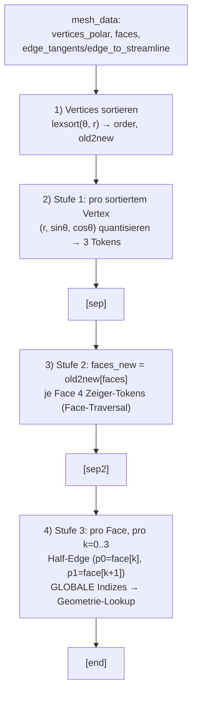
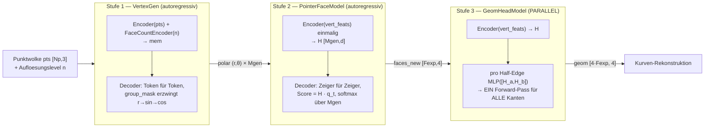
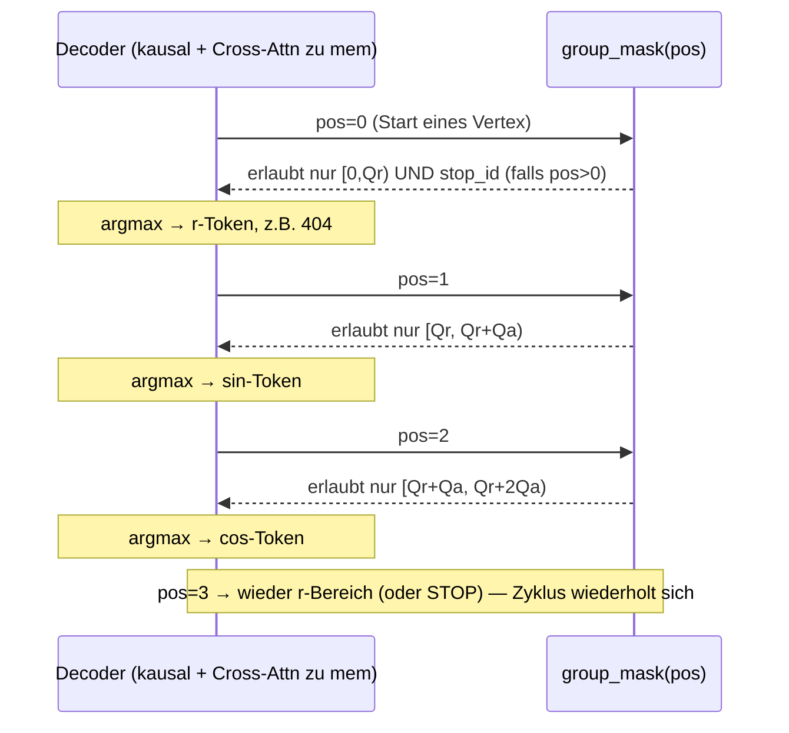
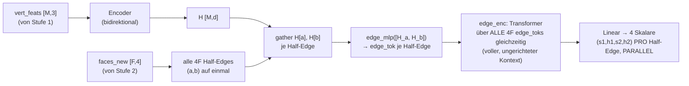
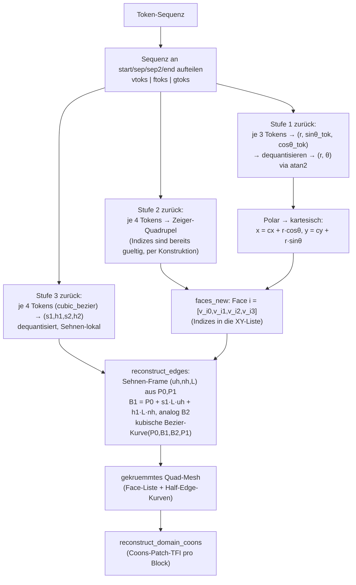

# 07 — PolyGen Walkthrough: Mesh → Tokens → Modell → Tokens → Mesh

> Begleitdokument zu [05_face_block_generator.md](05_face_block_generator.md). Dort steht das
> **Konzept** (warum drei Stufen, warum Pointer-Faces). Hier steht der **Mechanismus**: jeder
> Schritt der Pipeline an einem konkreten, durchgerechneten Mini-Beispiel, mit dem exakten Code
> dahinter (`prototype_twostage.py`, `vertex_head_prototype.py`, `pointer_head_prototype.py`,
> `geom_head_prototype.py`, `chain_e2e.py`).

## 0. Beispiel-Mesh

Zwei Quads, die eine vertikale Kante teilen (didaktisch gewählt, keine echten Domain-Partition-Daten
— zeigt aber echtes Verhalten des Codes, inkl. Fallback für fehlende Streamline-Daten):

```
old-Indizes (kartesisch, center=(0,0) für die Polar-Umrechnung):

  v3(1,2)───v2(2,2)───v5(3,2)
    │  Face A  │  Face B  │
  v0(1,1)───v1(2,1)───v4(3,1)

  Face A = [v0, v1, v2, v3]   (old 0,1,2,3)
  Face B = [v1, v4, v5, v2]   (old 1,4,5,2)

  geteilte Kante: A durchläuft v1→v2, B durchläuft v2→v1 (Gegenrichtung = "Twin")
```

Dieses Objekt ist das `mesh_data`-Dict, das `TwoStageTokenizer.tokenize()` erwartet:

| Feld | Inhalt | Shape |
|---|---|---|
| `vertices_polar` | `(r, θ)` je Vertex, um `center` | `[M,2]` |
| `vertices_cartesian` | `(x,y)` je Vertex | `[M,2]` |
| `faces` | Face → 4 **globale** Vertex-Indizes | `[4,F]` |
| `edge_index` | gerichtete Kante → `(u,v)` global | `[2,E]` |
| `edge_tangents` | `(α_start, tn_start, α_end, tn_end)` je gerichteter Kante (nur `hermite`) | `[E,4]` |
| `edge_to_streamline` | `(u,v) → [N,2]` echte Kantenpunkte (für `cubic_bezier`-Fit) | dict |
| `center` | Referenzpunkt für Polar-Umrechnung | `[2]` |

---

## 1. Tokenize: Mesh → Tokens (`TwoStageTokenizer.tokenize`, `prototype_twostage.py:136`)



### Schritt 1 — Vertices sortieren

`_sort_order` (`prototype_twostage.py:108`) sortiert **lexikografisch nach `(θ, r)`**, `θ` primär.
Das ist wichtig: die Reihenfolge ist **deterministisch aus der Geometrie ableitbar** — Modell und
Tokenizer brauchen keine willkürliche Eingabe-Reihenfolge zu lernen, jedes Mesh hat *eine* kanonische
Zielsequenz.

Polar-Koordinaten unserer 6 Vertices (`center=(0,0)`):

| old | (x,y) | r | θ (rad) | θ (deg) |
|---|---|---|---|---|
| 0 | (1,1) | 1.414 | 0.785 | 45.0° |
| 1 | (2,1) | 2.236 | 0.464 | 26.6° |
| 2 | (2,2) | 2.828 | 0.785 | 45.0° |
| 3 | (1,2) | 2.236 | 1.107 | 63.4° |
| 4 | (3,1) | 3.162 | 0.322 | 18.4° |
| 5 | (3,2) | 3.606 | 0.588 | 33.7° |

Sortiert nach θ aufsteigend (v0/v2 haben denselben Winkel — dieselbe Ursprungsgerade — Gleichstand
wird per `r` aufsteigend gebrochen):

| new | old | r | θ |
|---|---|---|---|
| 0 | 4 | 3.162 | 0.322 |
| 1 | 1 | 2.236 | 0.464 |
| 2 | 5 | 3.606 | 0.588 |
| 3 | 0 | 1.414 | 0.785 |
| 4 | 2 | 2.828 | 0.785 |
| 5 | 3 | 2.236 | 1.107 |

Daraus `old2new`: `[3, 1, 4, 5, 0, 2]` (alter Index → neue Position).

### Schritt 2 — Stufe 1: Vertex-Tokens

Jeder Vertex wird zu 3 Tokens `(r_tok, sinθ_tok, cosθ_tok)` quantisiert (`_q_scalar`,
`_q_angle`, `prototype_twostage.py:86-105`). Winkel werden **immer als sin/cos-Paar** kodiert statt
als roher Winkelwert — das vermeidet den Wrap-around bei ±π (0.01 rad und 6.28 rad wären als rohe
Zahl weit auseinander, obwohl geometrisch benachbart).

Durchgerechnet für `new=0` (old v4, r=3.162, θ=0.322 rad), mit Beispiel-Bounds `Qr=512, Qa=256,
R_MIN=0, R_MAX=4` (reale Bounds werden via `TwoStageTokenizer.fit_bounds()` einmal über den ganzen
Datensatz gemessen, nicht pro Mesh — sonst wäre zur Inferenzzeit nichts dequantisierbar):

```
r_tok  = round((3.162 - 0) / 4 * 511)               = 404        (Bereich [0, 511])
sin θ  = 0.316  →  s = (0.316+1)/2 = 0.658  →  s_tok = round(0.658*255) = 168
cos θ  = 0.949  →  c = (0.949+1)/2 = 0.974  →  c_tok = round(0.974*255) = 248

finale Tokens (mit Offsets off_r=0, off_ts=Qr=512, off_tc=Qr+2·... =768):
   r   = 404
   sin = 512 + 168 = 680
   cos = 768 + 248 = 1016
```

Dieselbe Rechnung für alle 6 sortierten Vertices ergibt die **Stufe-1-Token-Kette**:

```
[start]  404 680 1016 | ... | ... | ... | ... | ...        (6 × 3 = 18 Tokens)
          └─ new0 ──┘   new1  new2  new3  new4  new5
```

### Schritt 3 — `[sep]`, dann Stufe 2: Faces als Zeiger

`faces_new = old2new[faces]` (`prototype_twostage.py:164`) — die Face-Definition wird von **globalen**
auf **neue, sortierte** Indizes umgemappt:

```
Face A old [0,1,2,3]  →  new [3,1,4,5]
Face B old [1,4,5,2]  →  new [1,0,2,4]
```

Token-Offset für Zeiger: `off_idx = Qr + 2·Qa = 1024`. Die Stufe-2-Tokens sind also
`Zeiger-Index + 1024`:

```
[sep]  1027 1025 1028 1029 | 1025 1024 1026 1028        (2 Faces × 4 = 8 Tokens)
        └──── Face A ────┘   └──── Face B ────┘
```

**Das ist der Kernpunkt der ganzen Architektur:** `1027` bedeutet nicht "Koordinate 1027", sondern
"Zeiger auf Vertex an Position 3 in der oben erzeugten Stufe-1-Liste" — und Position 3 **existiert
garantiert**, weil sie gerade erst generiert wurde. Es kann keinen Zeiger auf eine Position 9 geben,
wenn nur 6 Vertices generiert wurden (siehe Abschnitt 2.2, Pointer-Softmax).

### Schritt 4 — `[sep2]`, dann Stufe 3: Kantengeometrie pro gerichteter Half-Edge

Pro Face und pro `k=0..3` wird die Half-Edge `(p0, p1) = (face[k], face[(k+1)%4])` **in globalen
Indizes** gebildet (`prototype_twostage.py:184` — bewusst global, weil `edge_to_streamline`/
`edge_tangents` mit globalen IDs indiziert sind):

```
Face A global [0,1,2,3]:  (0,1)  (1,2)  (2,3)  (3,0)
Face B global [1,4,5,2]:  (1,4)  (4,5)  (5,2)  (2,1)
                                         └───┬───┘
                                    Twin-Paar: (1,2) aus A und (2,1) aus B
                                    sind dieselbe physische Kante, GEGENLÄUFIG.
                                    Kein {u,v}-Dedup → beide werden unabhängig
                                    kodiert (wichtig bei Blade Druck-/Saugseite,
                                    wo (u→v) und (v→u) KEINE Umkehrung sind).
```

Für `repr_mode='cubic_bezier'` (Default-Empfehlung, siehe
[06_edge_geometry_study.md](06_edge_geometry_study.md)) werden 2 Bézier-Kontrollpunkte **Sehnen-lokal**
kodiert: `s` = Position längs der Sehne P0→P1, `h` = Auslenkung quer dazu, beides in Chord-Einheiten.
Für unser synthetisches Beispiel gibt es keine `edge_to_streamline`-Daten → der Tokenizer fällt auf
den **geraden** Default zurück (`prototype_twostage.py:192`, derselbe Pfad wie bei echten fehlenden
Kanten im Datensatz, gezählt in `meta['n_missing_edges']`):

```
s1, h1, s2, h2 = 1/3, 0.0, 2/3, 0.0     # Kontrollpunkte auf der Geraden → keine Krümmung
```

Alle 8 Half-Edges (4 pro Face × 2 Faces = **4F** Half-Edges) bekommen je 4 Tokens:

```
[sep2]  q(⅓,0) q(⅔,0) | q(⅓,0) q(⅔,0) | ... (4 mal je Face)   (8 × 4 = 32 Tokens)
[end]
```

### Die vollständige Sequenz für dieses Mesh

```
[start]  18 Tok (6 Vertices)  [sep]  8 Tok (2 Faces)  [sep2]  32 Tok (8 Half-Edges)  [end]
   1          18                1         8               1         32                 1
```

`vocab_size = off_idx + Vmax + 6` (6 Spezial-Tokens: start, end, sep, sep2, stop, pad) —
**ein einziges, festes Vokabular für die ganze Sequenz**, obwohl die drei Abschnitte semantisch
komplett verschiedene Dinge bedeuten (Koordinate vs. Index vs. Kontrollpunkt).

---

## 2. Generate: wie die drei Modelle tatsächlich Tokens erzeugen

Wichtig: **alle drei Stufen sind zur Trainings-/Generierungszeit getrennte Modelle** mit eigenem
Forward-Pass — es ist kein einzelner Transformer, der die ganze Sequenz oben am Stück erzeugt. Das
Tokenizer-Layout in Abschnitt 1 beschreibt nur, wie die Zielwerte für die drei Modelle *kodiert*
werden.



### 2.1 Stufe 1 — autoregressiv, mit `group_mask` (`vertex_head_prototype.py:117,197`)

Der Decoder generiert **ein Token nach dem anderen**, ganz normal kausal + Cross-Attention auf die
Punktwolken-Latents. Das Besondere: `group_mask` verbietet an jeder Position alle Vokabular-Bereiche
außer dem, der an dieser Position im 3er-Rhythmus erwartet wird:



Das ist **constrained decoding auf Token-Gruppen-Ebene**: das Modell könnte durch reines Lernen
lernen, an Position `pos%3==0` einen r-Wert vorherzusagen — `group_mask` erzwingt es *hart*, sodass
eine falsche Tokenanzahl pro Vertex (der klassische Fehlerpfad, der bei `MeshtronDomain` zu leeren
Panels führte) **strukturell ausgeschlossen** ist. `STOP` ist nur an einer Tripel-Grenze erlaubt
(`pos%3==0, pos>0`) — das Modell kann nicht mitten in einem Vertex abbrechen.

Konditionierung: nicht direkt auf die Ziel-Face-Zahl, sondern auf ein **Auflösungslevel `n`**
(`FaceCountEncoder(n)` als zusätzliches Memory-Token an die Punktwolken-Latents gehängt). Grund
(`vertex_head_prototype.py:10-16`): Geometrie kommt aus der Punktwolke, Auflösung ist der eigentliche
1-Freiheitsgrad-Regler; `F=6n²` ist nur ein nichtlinearer Proxy dafür in diesem konkreten
6-Block-Template. Generation stoppt, wenn `STOP` gewählt wird **oder** ein Cap erreicht ist.

### 2.2 Stufe 2 — autoregressiv, aber über Pointer statt Vokabular (`pointer_head_prototype.py:135`)

```mermaid
sequenceDiagram
    participant Enc as Encoder (bidirektional, EINMAL)
    participant Dec as Decoder (kausal, Cross-Attn zu H)
    Note over Enc: H = encode(vert_feats)  — [Mgen, d], wird NICHT neu berechnet
    loop bis 4·Fexp Zeiger erzeugt
        Dec->>Dec: dec_in = [start] + H[bisher gewählte Indizes]
        Dec->>Dec: dec_out = Decoder(dec_in, memory=H)
        Dec->>Enc: q = q_proj(dec_out[-1]);  logits = H · q   (Skalarprodukt mit JEDEM H_m)
        Note over Enc,Dec: softmax NUR über Mgen Optionen (kein Vokabular!)
        Dec->>Dec: naechster Zeiger = argmax(logits)  → an Sequenz anhängen
    end
```

Wie in der vorigen Antwort erklärt: es wird **kein Speicherzeiger** generiert, sondern ein ganz
normaler Integer-Token — nur ist die "Vokabular-Matrix" für diesen Token **live berechnet** (`H`,
abhängig vom aktuellen Mesh) statt fest gelernt. `H` wird **einmal** encodiert und dann für alle
Decoder-Schritte wiederverwendet (die Vertex-Positionen ändern sich während der Face-Generierung
nicht mehr — Stufe 1 ist bereits abgeschlossen).

**Wie viele Zeiger generiert werden**, ist in `chain_e2e.py:79-83` aktuell **explizit vorgegeben**,
nicht selbst vom Modell entschieden:

```python
Fexp = 6 * n * n                      # Face-Zahl EXPLIZIT aus dem bekannten Aufloesungslevel n
ptrs = pmodel.generate(vf, 4 * Fexp)  # 4F Zeiger, harte Anzahl
```

Das ist spezifisch für das aktuelle **6-Block-Template** (Airfoil-O-Grid-artig, `F=6n²` durch
Subdivision) und **kein allgemeiner Stop-Mechanismus**. Für die tistos-3D-Daten, wo `blocks` eine
beliebige, nicht formelhaft ableitbare Anzahl hat (16 Hex-Blöcke im Beispiel-Sample, variiert pro
Maschine), müsste Stufe 2 entweder (a) selbst per Stop-Token entscheiden, wann Schluss ist, oder
(b) weiterhin extern konditioniert werden — z. B. über einen echten `FaceCountEncoder`-Wert statt
der `n²`-Formel. Das ist ein offener Punkt für die 3D-Erweiterung.

### 2.3 Stufe 3 — NICHT autoregressiv, ein einziger Parallel-Pass (`geom_head_prototype.py:80`)



Begründung (`geom_head_prototype.py:10`): sobald Stufe 1+2 stehen, ist die **komplette Topologie
bekannt** — es gibt keine sequenzielle Abhängigkeit zwischen den Kantengeometrien, die ein
autoregressives Modell rechtfertigen würde. Ein einziger Forward-Pass sagt alle `4F`
Kontrollpunkt-Quadrupel gleichzeitig voraus (Loss: `SmoothL1` auf die 4 Skalare je Kante). Das ist
gleichzeitig ein **Effizienzgewinn** (kein `O(4F)`-serieller Decoder-Loop) und **korrekt**, weil hier
keine Kausalität zu modellieren ist.

Die Kanten-Richtung geht direkt in die Modell-Eingabe ein: `edge_mlp([H[a], H[b]])` — **nicht**
symmetrisch in `a,b` — deshalb erzeugt `(a,b)` einen anderen Edge-Token als `(b,a)`, was die
Multigraph-Eigenschaft (Twin-Paare können unterschiedliche Geometrie tragen, z. B. Blade
Druck-/Saugseite) korrekt abbildet.

---

## 3. Detokenize: Tokens → Mesh (`TwoStageTokenizer.detokenize`, `prototype_twostage.py:228`)

Der Rückweg ist mechanisch die Umkehrung von Abschnitt 1, mit einem zusätzlichen Rekonstruktionsschritt
für die Kurven:



### Schritt für Schritt

1. **Sequenz aufteilen** (`prototype_twostage.py:241-254`): Indizes von `start`, `sep`, `sep2`, `end`
   finden, die drei Abschnitte `vtoks`, `ftoks`, `gtoks` herausschneiden.
2. **Stufe 1 dequantisieren**: `r = _dq_scalar(r_tok, R_MIN, R_MAX)` (lineare Rückskalierung),
   `θ = atan2(dq(sin_tok), dq(cos_tok))` — der `atan2`-Umweg über sin/cos ist genau das, was den
   Wrap-around bei ±π vermeidet, den eine rohe Winkel-Quantisierung hätte.
3. **Stufe 2 „dequantisieren"**: trivial — `Zeiger-Token - off_idx` ergibt direkt den Index in die
   gerade rekonstruierte Vertexliste. Kein Validitäts-Check nötig, weil das Pointer-Netzwerk
   (Abschnitt 2.2) per Konstruktion nur gültige Indizes erzeugen konnte.
4. **Stufe 3 dequantisieren**: `(s1,h1,s2,h2)` zurück in den realen Wertebereich, dann in
   `reconstruct_edges` (`prototype_twostage.py:365`) pro Half-Edge:
   - Sehnen-Frame `(uh, nh, L)` aus den (jetzt bekannten) kartesischen Endpunkten `P0, P1` bauen.
   - Kontrollpunkte zurück in absolute Koordinaten: `B1 = P0 + s1·L·uh + h1·L·nh` (und analog `B2`).
   - Kubische Bézier-Kurve `(1-t)³P0 + 3(1-t)²t·B1 + 3(1-t)t²·B2 + t³·P1` auswerten
     (`_cubic_bezier_curve`, Zeile 334).
5. **Weiterreichen an TFI**: Die fertigen Face-Listen + gekrümmten Kanten sind die Eingabe für
   `reconstruct_domain_coons` (Coons-Patch pro Block) und `blade_inject.py` (bekannte Blade-Kanten
   exakt überschreiben) — das liegt **außerhalb** des Tokenizers, ist aber der einzige Grund, warum
   die Pipeline überhaupt existiert (Ziel ist ein CFD-vernetzbares Mesh, nicht die Token-Sequenz).

### Rundreise-Garantie

`round_trip_report` (`prototype_twostage.py:412`) tokenisiert → detokenisiert → vergleicht gegen die
Ground Truth, getrennt nach: Topologie (exakter Integer-Vergleich der Face-Indizes), Vertex-Fehler
(`r`, Winkel, kartesisch) und Geometrie-Fehler (rekonstruierte Kurve vs. `edge_to_streamline`,
relativ zur Sehnenlänge). Dokumentiertes Ergebnis über 300 echte Meshes: Topologie 300/300 exakt,
`cubic_bezier`-Geometriefehler median 0.7 % / mean 1.2 % der Sehnenlänge (siehe
[05_face_block_generator.md](05_face_block_generator.md), Abschnitt „validiert im Prototyp").

---

## 4. Zusammenfassung: was ist an welcher Stelle "der Token"?

| Sequenz-Abschnitt | Token bedeutet | Vokabular-Ursprung | Generierungsart |
|---|---|---|---|
| Stufe 1 (Vertices) | quantisierte Koordinate `(r, sinθ, cosθ)` | fest gelernte Embedding-Zeilen | autoregressiv, `group_mask` |
| Stufe 2 (Faces) | Index in die **eigene** Stufe-1-Ausgabe | live berechnet aus `H` (Pointer) | autoregressiv, Pointer-Softmax |
| Stufe 3 (Geometrie) | quantisierter Bézier-Kontrollpunkt-Offset | fest gelernte Embedding-Zeilen (im Tokenizer-Layout) — **im Modell selbst nicht als Token, sondern als Regressionsziel** (`SmoothL1`, keine Cross-Entropy) | parallel, ein Forward-Pass |

Ein Detail, das leicht übersehen wird: `geom_head_prototype.py` sagt die vier Skalare `(s1,h1,s2,h2)`
**direkt als reelle Zahlen** voraus (Regression, `nn.Linear(d_model, 4)` + `SmoothL1Loss`), **nicht**
als klassifizierte Tokens aus dem Vokabular. Die Tokenisierung von Stufe 3 in
`prototype_twostage.py` existiert vor allem für den **Tokenizer-Roundtrip-Test** und als
konsistentes Sequenzformat — im tatsächlich trainierten Drei-Modell-Setup (`chain_e2e.py`) ist Stufe
3 ein Regressionskopf, kein weiterer Token-Klassifikator.

---

## 5. Literatur

### Direkt zu PolyGen / den drei Bausteinen

| Referenz | Was daraus verwendet wird |
|---|---|
| **PolyGen** — Nash, Ganin, Eslami, Battaglia, *"PolyGen: An Efficient Transformer-Based Generative Model for Polygon Meshes"*, ICML 2020. [arXiv:2002.10880](https://arxiv.org/abs/2002.10880) | Die Grundidee der ganzen Architektur: Vertex-Modell (autoregressiv, quantisierte Koordinaten) + Face-Modell als Pointer-Network. Namensgeber für "PolyGen". |
| **Pointer Networks** — Vinyals, Fortunato, Jaitly, NeurIPS 2015. [arXiv:1506.03134](https://arxiv.org/abs/1506.03134) | Der Pointer-Mechanismus selbst (Softmax über Encoder-Zustände statt über ein festes Vokabular), den `PointerFaceModel` implementiert. PolyGen wendet dieses Konzept erstmals auf Meshes an. |
| **Perceiver** — Jaegle et al., ICML 2021. [arXiv:2103.03206](https://arxiv.org/abs/2103.03206) | Cross-Attention von einer festen Anzahl Latents auf eine variable Eingabemenge — Vorbild für `PerceiverPointEncoder` (Punktwolke → `n_latents`). |
| **MeshTron** — NVIDIA, *"MeshTron: High-Fidelity, Artist-Like 3D Mesh Generation at Scale"*, 2024. [arXiv:2412.09548](https://arxiv.org/abs/2412.09548) (lokal: `literatur/2412.09548v1.pdf`) | Namensgeber dieses Repos. Hourglass-Transformer + Sliding-Window-Attention, hierarchisch (Vertex-Tokens → Face-Tokens). Aktuelles `hourglass_transformer.py` ist bewusst eine vereinfachte, flache Variante davon. |
| **Hierarchical Transformers ("Hourglass")** — Nawrot et al., 2021. [arXiv:2110.13711](https://arxiv.org/abs/2110.13711) (lokal: `literatur/2110.13711v2.pdf`) | Ursprung des Hourglass-Konzepts (Shortening/Upsampling zwischen Transformer-Stufen), das `hourglass_transformer.py` namentlich referenziert, aktuell aber nicht implementiert (flache Stufen). |
| **RoFormer (RoPE)** — Su et al., 2021. [arXiv:2104.09864](https://arxiv.org/abs/2104.09864) | Rotary Positional Embeddings, verwendet in `attention.py`/`positional_encoder.py` für die kausale Self-Attention aller drei Modellfamilien. |

### Verwandte Ansätze (Kontext, aus dem bestehenden Survey)

Vollständige Einordnung inkl. Bewertung für unser Problem: [02_literature_survey.md](02_literature_survey.md).

| Referenz | Bezug zu PolyGen hier |
|---|---|
| **MeshGPT** — Siddiqui et al., 2023. [arXiv:2311.15475](https://arxiv.org/abs/2311.15475) | Alternative zu roher Koordinaten-Quantisierung: gelerntes VQ-Vokabular über Face-Embeddings. Braucht mehr Daten (Codebook-Collapse-Risiko bei kleinen Datensätzen wie unserem). |
| **EdgeRunner** — 2024. [arXiv:2409.18114](https://arxiv.org/abs/2409.18114) | Autoregressiver Auto-Encoder über Half-Edges — dieselbe Grundidee "Half-Edge als Tokenisierungs-Einheit", die Stufe 3 hier für die Kantengeometrie nutzt. |
| **QuadGPT** — 2025. [arXiv:2509.21420](https://arxiv.org/abs/2509.21420) | Native Quad-Generierung ohne Tri-Umweg — bestätigt den hier gewählten Ansatz (Quads direkt, keine Triangulierung als Zwischenschritt). |
| **BrepGen** — 2024. [arXiv:2401.15563](https://arxiv.org/abs/2401.15563) | Kanten/Flächen als Kontrollnetze (NURBS-Poles) statt punktweise — dieselbe Grundidee wie die `cubic_bezier`-Kontrollpunkte in Stufe 3, dort per Diffusion statt Regression. |
| **QuadLink** — 2026. [arXiv:2605.16813](https://arxiv.org/abs/2605.16813) | Alternative Gültigkeits-Strategie: geometrische Verifikation statt Pointer-Konstruktion. Interessant als Vergleichspunkt, falls Pointer-Netzwerke bei 3D-Hex-Blöcken (8 statt 4 Zeiger) an Grenzen stoßen. |

### Bereits im Repo vorhandene PDFs ohne direkten Architektur-Bezug

`literatur/2504.19874v1.pdf` (TurboQuant, Vektorquantisierung) und `literatur/polarquant.pdf`
(PolarQuant, Polar-Transformation für KV-Cache-Quantisierung) sind thematisch angrenzend
(Quantisierungs-/Polar-Techniken), aber nicht direkt Teil der PolyGen-Architektur — vermutlich als
Hintergrundlektüre zur Quantisierungsstrategie (`_q_scalar`/`_q_angle`, Polar-Koordinaten) gesammelt.

## 6. BibTeX

Zitierfähige Einträge für die Kern-Referenzen aus Abschnitt 5 (Konferenz-/Journal-Angaben wo bekannt,
sonst `eprint`/`archivePrefix` auf arXiv):

```bibtex
@inproceedings{nash2020polygen,
  title     = {{PolyGen}: An Efficient Transformer-Based Generative Model for Polygon Meshes},
  author    = {Nash, Charlie and Ganin, Yaroslav and Eslami, S. M. Ali and Battaglia, Peter W.},
  booktitle = {Proceedings of the 37th International Conference on Machine Learning (ICML)},
  year      = {2020},
  eprint    = {2002.10880},
  archivePrefix = {arXiv}
}

@inproceedings{vinyals2015pointer,
  title     = {Pointer Networks},
  author    = {Vinyals, Oriol and Fortunato, Meire and Jaitly, Navdeep},
  booktitle = {Advances in Neural Information Processing Systems (NeurIPS)},
  year      = {2015},
  eprint    = {1506.03134},
  archivePrefix = {arXiv}
}

@inproceedings{jaegle2021perceiver,
  title     = {Perceiver: General Perception with Iterative Attention},
  author    = {Jaegle, Andrew and Gimeno, Felix and Brock, Andrew and Vinyals, Oriol
               and Zisserman, Andrew and Carreira, Joao},
  booktitle = {Proceedings of the 38th International Conference on Machine Learning (ICML)},
  year      = {2021},
  eprint    = {2103.03206},
  archivePrefix = {arXiv}
}

@article{nvidia2024meshtron,
  title   = {{MeshTron}: High-Fidelity, Artist-Like {3D} Mesh Generation at Scale},
  author  = {{NVIDIA}},
  year    = {2024},
  eprint  = {2412.09548},
  archivePrefix = {arXiv}
}

@article{nawrot2021hourglass,
  title   = {Hierarchical Transformers Are More Efficient Language Models},
  author  = {Nawrot, Piotr and Tworkowski, Szymon and Tyrolski, Micha{\l} and Kaiser,
             {\L}ukasz and Wu, Yuhuai and Szegedy, Christian and Michalewski, Henryk},
  year    = {2021},
  eprint  = {2110.13711},
  archivePrefix = {arXiv}
}

@article{su2021roformer,
  title   = {{RoFormer}: Enhanced Transformer with Rotary Position Embedding},
  author  = {Su, Jianlin and Lu, Yu and Pan, Shengfeng and Murtadha, Ahmed and Wen, Bo
             and Liu, Yunfeng},
  year    = {2021},
  eprint  = {2104.09864},
  archivePrefix = {arXiv}
}

@article{siddiqui2023meshgpt,
  title   = {{MeshGPT}: Generating Triangle Meshes with Decoder-Only Transformers},
  author  = {Siddiqui, Yawar and Alliegro, Antonio and Artemov, Alexey and Tommasi, Tatiana
             and Sirigatti, Daniele and Rosov, Vladislav and Dai, Angela and Nie{\ss}ner, Matthias},
  year    = {2023},
  eprint  = {2311.15475},
  archivePrefix = {arXiv}
}

@article{tang2024edgerunner,
  title   = {{EdgeRunner}: Auto-regressive Auto-encoder for Artistic Mesh Generation},
  author  = {Tang, Jiaxiang and others},
  year    = {2024},
  eprint  = {2409.18114},
  archivePrefix = {arXiv}
}

@article{quadgpt2025,
  title   = {{QuadGPT}: Native Quadrilateral Mesh Generation with Autoregressive Transformers},
  author  = {{[Autor:innen siehe arXiv-Eintrag]}},
  year    = {2025},
  eprint  = {2509.21420},
  archivePrefix = {arXiv}
}

@article{xu2024brepgen,
  title   = {{BrepGen}: A B-rep Generative Diffusion Model with Structured Latent Geometry},
  author  = {Xu, Xiang and Lambourne, Joseph G. and Jayaraman, Pradeep Kumar and Wang, Zhengqing
             and Willis, Karl D. G. and Furukawa, Yasutaka},
  year    = {2024},
  eprint  = {2401.15563},
  archivePrefix = {arXiv}
}

@article{quadlink2026,
  title   = {{QuadLink}: Generating Quad Meshes from Point Clouds via Centroid-Conditioned Links},
  author  = {{[Autor:innen siehe arXiv-Eintrag]}},
  year    = {2026},
  eprint  = {2605.16813},
  archivePrefix = {arXiv}
}
```

> Zwei Einträge (`quadgpt2025`, `quadlink2026`) haben Platzhalter bei `author`, weil die
> Autor:innen beim Erstellen dieses Dokuments nicht verifiziert wurden — vor Verwendung in einer
> Arbeit die arXiv-Seite selbst prüfen (Links in Abschnitt 5).
